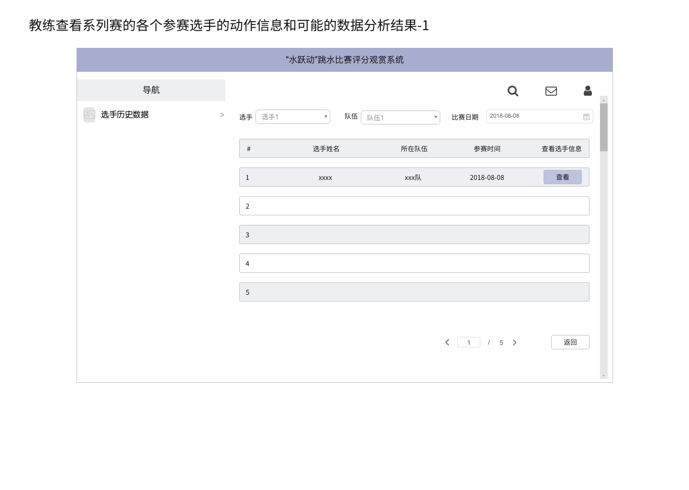
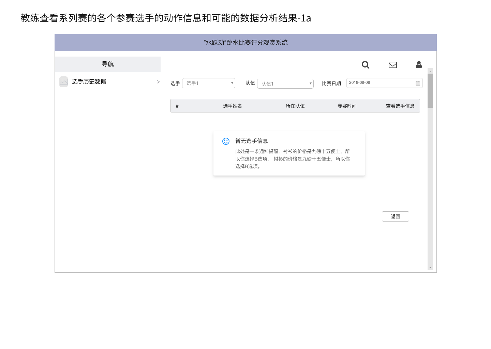
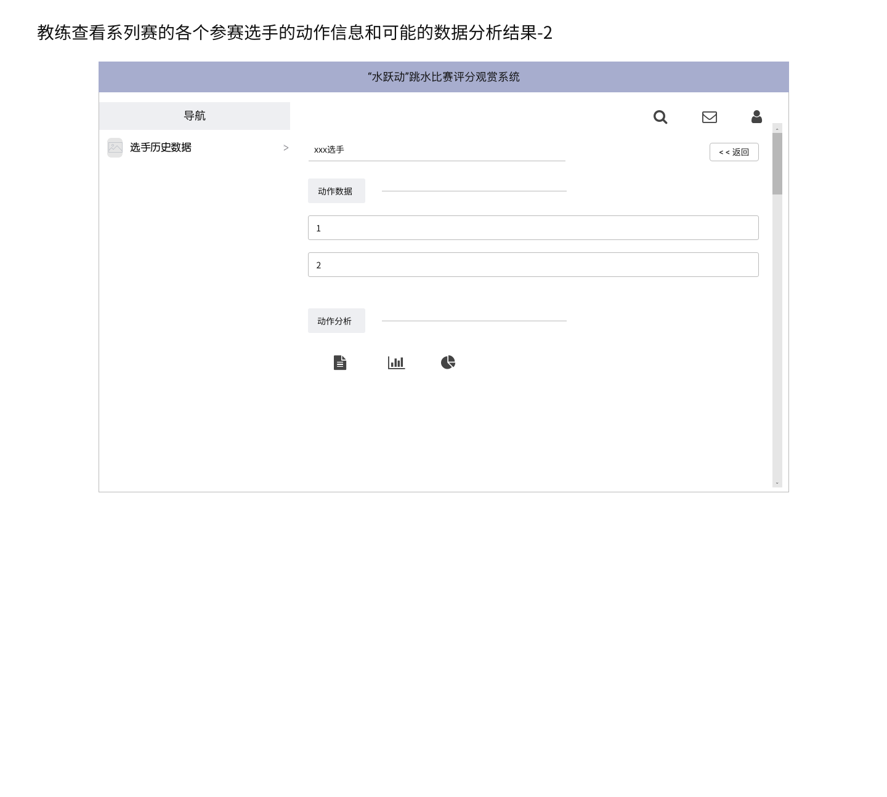
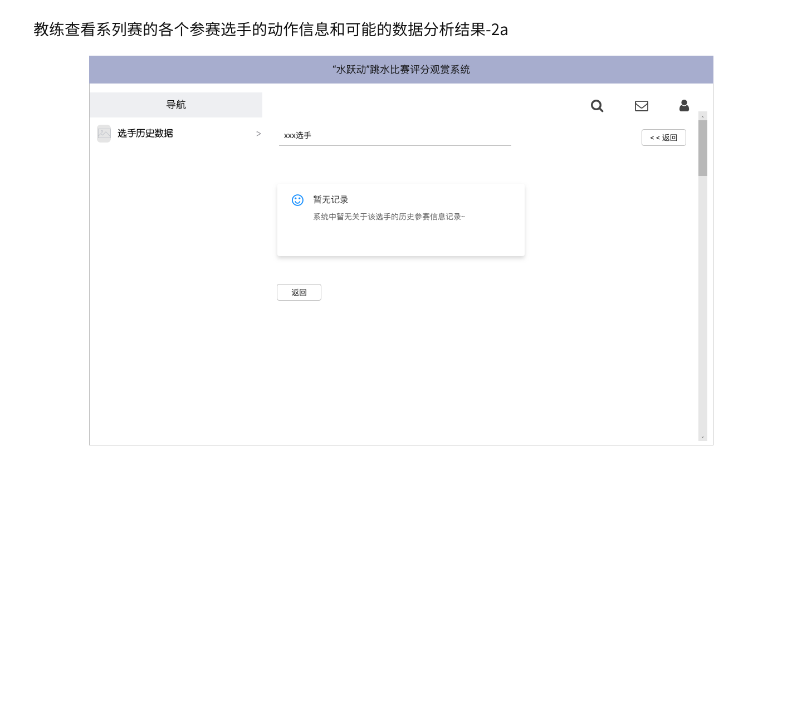

# 原型物件
## 一、原型使用说明

| 系统特性ID | 描述 | 是否清晰 | 原型使用情况 |
|---|---|---|---|
| FE-1 | 系统提示选手执行动作的难度信息(实时) | 清晰 | / |
| FE-2 | 系统提供视频回放 | 清晰 | / |
| FE-3 | 系统提供匿名打分 | 清晰 | / |
| FE-4 | 系统自动接收硬件数据实时录入系统并公开 | 清晰 | / |
| FE-5 | 对重要信息进行备份，防止数据丢失 | 清晰 | / |
| FE-6 | 系统记录选手在系列大赛中参赛信息，可以细到动作信息(样式和难度)(实时) | 清晰 | / |
| FE-7 | 系统对系列赛的各个参赛选手的动作信息进行数据分析，给出可能的动作结果(实时) | 清晰 | / |
| FE-8 | 教练能够实时拿到刚刚比赛完选手的视频详细动作信息，裁判打分结果 | 清晰 | / |
| FE-9 | 教练可以拿到系列赛的各个参赛选手的动作信息和可能的数据分析结果 | 具体交互过程还不够明确 | 探索式 |
| FE-10 | 系统提供给观看用户充值渠道成为专业观看用户 | 清晰 | / |
| FE-11 | 系统提供普通用户实时观看比赛 | 清晰 | / |
| FE-12 | 系统提供专业用户个性化观看体验，包括回放和裁判视角观看赛事 | 清晰 | / |

### 二、教练查看系列赛的各个参赛选手的动作信息和可能的数据分析结果的原型
#### 选手列表信息界面原型

#### 无选手信息界面原型

#### 选手历史数据界面原型

#### 选手历史数据不存在界面原型
