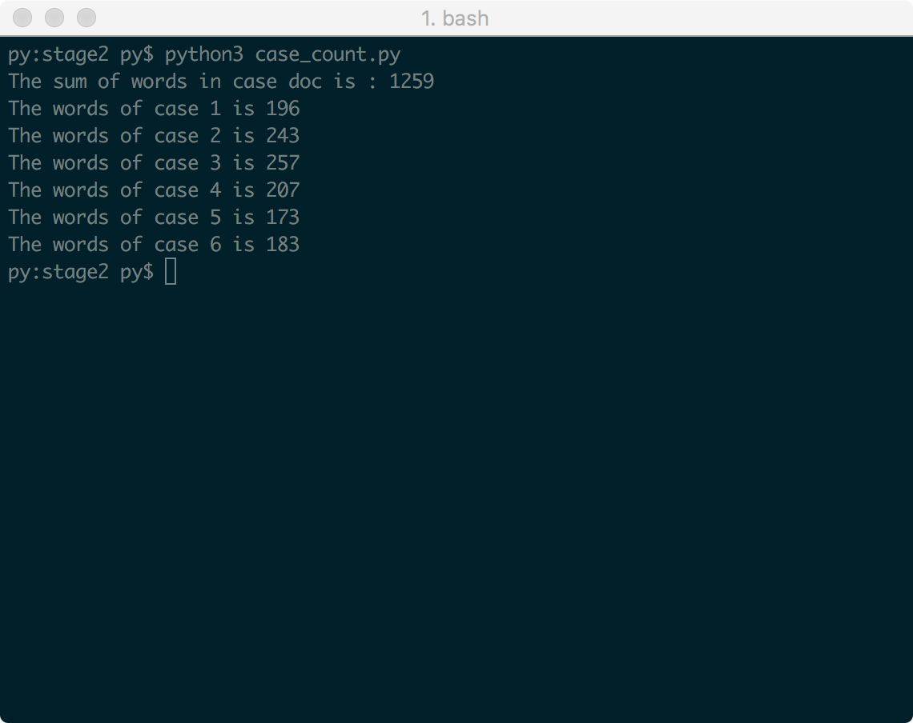

## 度量文档

需求获取的次数：4次

面谈方法获取的用例数量：4个 

原型方法获取的用例数量：2个

用户需求数量：3 + 6 + 5 = 14个

非功能需求的数量：5个

各类非功能需求占总需求的比率：

​    性能需求/总需求 = 1/14 = 7%
​    
​    质量属性需求/总需求 = 4/14 = 29%
​    
​    约束/总需求 = 0/14 = 0%
​    
​    其他需求/总需求 = 0/9 = 0%
​    
用例数量：6个

平均用例的场景数量：(1+3+4+2+1+1)/6=2.0

平均用例的字数：210

最大用例的字数：257

**统计方法使用[case_count.py](case_count.py)脚本统计**
