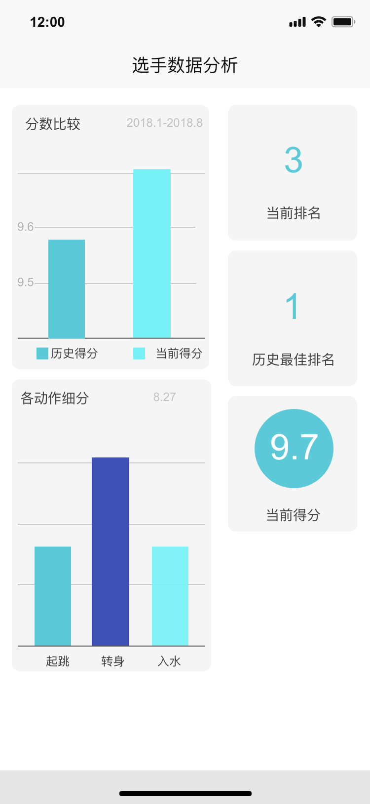

# 需求获取计划书
[toc]
## 一、引言
### 1.1. 编制目的
&nbsp;&nbsp;&nbsp;&nbsp;“水跃动”跳水比赛打分观赏系统能够保证提高裁判效率和公信度的同时通过吸引专业观看用户提高社团收益，并且对参赛选手的信息采集和数据分析方面有了极大的提升。比赛过程中选手的动画动作在裁判打分系统显示，难度信息提示在选手执行动作中，配套的硬件抓拍选手各个角度动作，然后裁判能够各个角度反复观看，完成打分。裁判在打分过程中完全匿名，在集体打分后显示分数，打分信息需要加密保存，只能查到裁判集体打分信息，不能查到个人打分这规避了裁判受到现场其它裁判的影响，提高了公正性。系统具有较高安全性能够对重要信息进行备份，防止数据丢失。系统通过硬件接口实施录入视频，公开信息以便为后来人提供详细信息供他们研究。系统记录选手在系列大赛中参赛信息，可以细到动作信息(样式和难度)，并对选手的动作偏好和难度进行简单分析。系统给一些客户端观众个性化体验的观赏。普通用户只能实时观看比赛，一些缴费的专业用户能够享受到裁判角度的观赏体验。

&nbsp;&nbsp;&nbsp;&nbsp;本文档是需求小组在进行需求工程实践中，需求获取阶段的产物，作用于整个需求获取阶段，主要描述了需求获取阶段的全程计划安排，作为执行指南和后续跟踪管理的依据。

### 1.2 词汇表
<table>
	<tr>
		<th>用语</th>
		<th>释义</th>
	</tr>
	<tr>
		<th>MeetingPre</th>
		<th>面谈准备</th>
	</tr>
	<tr>
		<th>Meeting</th>
		<th>面谈</th>
	</tr>
	<tr>
		<th>Goal</th>
		<th>目标</th>
	</tr>
	<tr>
		<th>Stkhd</th>
		<th>涉众</th>
	</tr>
	<tr>
		<th>V&S</th>
		<th>前景和范围</th>
	</tr>
	<tr>
		<th>MRev</th>
		<th>面谈分析</th>
	</tr>
	<tr>
		<th>Refine</th>
		<th>精化</th>
	</tr>
	<tr>
		<th>Prttp</th>
		<th>原型</th>
	</tr>
	<tr>
		<th>Doc</th>
		<th>文档</th>
	</tr>
	<tr>
		<th>ReviewPre</th>
		<th>评审准备</th>
	</tr>
	<tr>
		<th>Review</th>
		<th>评审</th>
	</tr>
</table>

### 1.3 参考资料
1. 骆斌，丁二玉.需求工程------软件建模与分析[M].北京：高等教育出版社，2009（2015.2重印）

2. “水跃动”跳水比赛打分观赏系统目标模型描述文档

3. “水跃动”跳水比赛打分观赏系统前景和范围文档

## 二、需求获取计划概要
### 2.1 需求获取活动
在进行了对上一阶段形成的目标模型的进一步审查和分析之后，综合考量系统的高层目标，系统的涉众和应用场景，我们在整个需求获取当中应该进行以下活动。

  1. 研究应用背景，分析现有类似系统，建立初始知识框架

  2. 支持和监控需求获取的过程的机制。

  3. 寻找相关涉众，进行涉众分析和涉众选择

  4. 根据目标模型，涉众特点，选择具体获取方法

  5. 先行确定获取活动的内容和主题，设定场景，执行需求获取具体活动

  6. 对需求获取具体活动的结果进行记录，分析和汇总

  7. 结合场景方法，进行用例分析，获得阶段制品即用例文档和用户需求列表

### 2.2  需求获取流程安排
<table>
	<tr>
		<th>内容</th>
		<th>活动时间</th>
	</tr>
	<tr>
		<th>背景与知识框架</th>
		<th>2018.10.2</th>
	</tr>
	<tr>
		<th>目标模型</th>
		<th>2018.10.7</th>
	</tr>
	<tr>
		<th>涉众分析与前景范围</th>
		<th>2018.10.12</th>
	</tr>
	<tr>
		<th>选择获取方法</th>
		<th>2018.10.14</th>
	</tr>
	<tr>
		<th>进行获取</th>
		<th>2018.10.18</th>
	</tr>
	<tr>
		<th>获取结果整理</th>
		<th>2018.10.18</th>
	</tr>
</table>

### 2.2 需求获取活动

### 2.2 需求获取流程图

## 三、需求获取阶段详细说明
### 3.1 背景与知识框架学习和研究
南京大学Autumn组对本系统的背景知识做了深入了解，对跳水比赛的流程进行模拟构建，并绘制如下流程原型模拟图

### 3.2 涉众分析与前景范围
工作组针对用户背景和亟待解决的问题，划归了高层次的系统目标，逐步向下，对项目问题目标建立模型和涉众分析最终形成了阶段一的项目前景和范围文档，其间得到了甲方的具体问题反馈，可见阶段一用户反馈文档，最终分析和模型得到了甲方的肯定与高度支持，特此感谢南京大学软件学院马伟学长及全组支持和答疑。

### 3.3 根据目标模型，涉众特点，选择具体获取方法
通过对涉众特点、项目目标、前景与范围以及资源成本等多方面的总和考虑，需求小组选择了以下方法进行需求的获取。其中，主要采用的是面谈方法和原型方法。面谈方法具有成本低，实践容易，提高涉众参与度等优点，针对面谈方法使用中可能存在的概念结构不同、模糊化描述、默认知识、潜在知识等现象，我们使用原型方法作为主要的补充手段，用于对细节和复杂部分的细化和分析。

### 3.3.1. 半结构化面谈
在需求初期阶段，工作组以目前掌握的知识框架为基础，进行问题准备。主要为了获取高层次的目标和特性，逐步建立系统的功能需求框架，然后在此框架基础上逐步细化。在此期间小组与甲方有了问题交流与反馈，但工作组已经掌握接近完备的功能点需求，强调对甲方需求细节方面的考量与完善，在此基础上有了部分原型图和场景以及故事板的辅助。在这一阶段需求获取已接近完备。

**所以我们在对需求包括背景有了深入了解的情况下放弃了半结构化面谈的方式以期提高工作组的整体效率。**

### 3.3.2 结构化面谈
在需求初期阶段，需求小组以目前掌握的知识框架为基础，进行问题准备。主要为了获取高层次的目标和特性，采用结构化面谈逐步建立系统的功能需求框架，然后在此框架基础上逐步细化。

在需求获取后期阶段，用例初稿和用户需求列表初步形成后，使用结构化面谈方法对初步需求产物进行审查和补漏。

**在基于对需求充分了解并和甲方沟通顺畅的情况下，采用结构化面谈提升了工作组的效率**

### 3.3.3 纸质原型
项目前景与范围确定之后，我们需要细化用户需求。运用用例和场景的分析方法，形成了系统用例图，一次为依据，明确系统和用户之间的交互。此时使用纸质原型，手绘界面草图，得到初步的功能模块和场景流程。

工作组采用墨刀等工具绘制界面草图，相较于传统纸质原型支持工作组所有成员线上及时修改，增强了及时性和修改性，有赖于工作组成员的工具熟练度较高，操作娴熟，增强了团队成员之间的合作和效率，并对用户用例细化起到了正面促进作用。

### 3.3.4 故事板原型
构建故事板，是将场景式的互动通过图形描述展现给用户，通过对用户反馈的收集和分析，进行进一步的需求明确。采用交互性介于动态程序和静态画面之间的场景串联图板，把各个画面相互联系起来，描述复杂的情节和步骤，并易于发现用户容易遗漏或者习以为常的交互序列，成本较低且制作简单。
通过使用故事板，我们给用户一个良好的指引方式，让用户能够直观并且全方位了解我们的功能，方便、快速地使用我们的系统，同时，故事板本身具有的趣味感也更加吸引眼球，也使得使用我们产品的各种用户能够喜欢并且爱上我们的系统。

#### 3.3.4.1 查看视频

#### 3.3.4.2 数据分析

#### 3.3.4.3 选手基本信息

#### 3.3.4.4 选手评分

#### 串联

## 3.4 获取执行
### 获取执行
<table>
	<tr>
		<th>活动ID</th>
		<th>活动名称</th>
		<th>活动内容</th>
		<th>预计完成时间</th>
	</tr>
	<tr>
		<th>MeetingPre1</th>
		<th>收集背景资料</th>
		<th>对系统产生的背景进行深入了解剖析，为后续做好准备</th>
		<th>2018.9.30</th>
	</tr>
	<tr>
		<th>Meeting1</th>
		<th>面谈</th>
		<th>第一次面谈，对问题进行明确，了解用户对系统的总体范围、前景和部分应用细节</th>
		<th>2018.10.2</th>
	</tr>
	<tr>
		<th>MRev</th>
		<th>面谈分析</th>
		<th>整理第一次面谈的结果，进行问题分析，目标建模</th>
		<th>2018.10.2</th>
	</tr>
	<tr>
		<th>Goal</th>
		<th>目标分析</th>
		<th>整理第一次面谈的结果，进行问题分析，目标建模</th>
		<th>2018.10.2</th>
	</tr>
   <tr>
		<th>Stkhd</th>
		<th>涉众分析</th>
		<th>进行基于目标模型的涉众分析</th>
		<th>2018.10.2</th>
	</tr>
	<tr>
		<th>V&S</th>
		<th>前景与范围定义</th>
		<th>结合用户反馈，对目标精化进行调整，继而完成项目前景和范围的定义，完成前景和范围文档的编写</th>
		<th>2018.10.2</th>
	</tr>
	<tr>
		<th>Refine1</th>
		<th>精化用例</th>
		<th>用例进行细化，拆分等，讨论分析</th>
		<th>2018.10.13</th>
	</tr>
   <tr>
		<th>MeeingPre2</th>
		<th>面谈材料和流程准备</th>
		<th>准备面谈问题列表，设定面谈问题模式，设计制作面谈记录表格</th>
		<th>2018.10.14</th>
	</tr>
	<tr>
		<th>Prttp1</th>
		<th>制作故事板</th>
		<th>分析场景绘制故事板</th>
		<th>2018.10.15</th>
	</tr>
	<tr>
		<th>Meeting3</th>
		<th>面谈</th>
		<th>基于故事板原型，执行面谈记录用户反馈</th>
		<th>2018.10.17</th>
	</tr>
	<tr>
		<th>MRev3</th>
		<th>面谈结果汇总、讨论、分析</th>
		<th>分析面谈结果，开会讨论，互相补充，达成一致</th>
		<th>2018.10.17</th>
	</tr>
    <tr>
		<th>Refine2 Doc1</th>
		<th>精化用例，用例文档编制，用户需求列表定义</th>
		<th>对所得用例进行文档化，完成文档初稿编制</th>
		<th>2018.10.18</th>
	</tr>
	<tr>
		<th>CheckPre1</th>
		<th>评审会议准备</th>
		<th>构建checklist，发放评审准备材料，工作组集体讨论分析</th>
		<th>2018.10.19</th>
	</tr>
	<tr>
		<th>Check1</th>
		<th>需求评审</th>
		<th>进行对文档的评审</th>
		<th>2018.10.19</th>
	</tr>
	<tr>
		<th>Doc2</th>
		<th>编写文档修改版</th>
		<th>修改文档更新版本</th>
		<th>2018.10.20</th>
	</tr>
	<tr>
		<th>CheckPre2</th>
		<th>评审会议准备</th>
		<th>更新构建checklist，再次上传评审准备材料，工作组集体讨论分析</th>
		<th>2018.10.20</th>
	</tr>
	<tr>
		<th>Check2</th>
		<th>需求评审</th>
		<th>再次进行对文档的评审</th>
		<th>2018.10.20</th>
	</tr>

</table>

#### 时间轴

## 四、执行结果
<table>
	<tr>
		<th>活动ID</th>
		<th>活动名称</th>
		<th>活动内容</th>
		<th>预计完成时间</th>
		<th>实际完成时间</th>
		<th>说明</th>
	</tr>
	<tr>
		<th>MeetingPre1</th>
		<th>收集背景资料</th>
		<th>对系统产生的背景进行深入了解剖析，为后续做好准备</th>
		<th>2018.9.30</th>
		<th>2018.9.30</th>
		<th>无</th>
	</tr>
	<tr>
		<th>Meeting1</th>
		<th>面谈</th>
		<th>第一次面谈，对问题进行明确，了解用户对系统的总体范围、前景和部分应用细节</th>
		<th>2018.10.2</th>
		<th>2018.10.2</th>
		<th>无</th>
	</tr>
	<tr>
		<th>MRev</th>
		<th>面谈分析</th>
		<th>整理第一次面谈的结果，进行问题分析，目标建模</th>
		<th>2018.10.2</th>
		<th>2018.10.2</th>
		<th>无</th>
	</tr>
	<tr>
		<th>Goal</th>
		<th>目标分析</th>
		<th>整理第一次面谈的结果，进行问题分析，目标建模</th>
		<th>2018.10.2</th>
		<th>2018.10.2</th>
		<th>无</th>
	</tr>
   <tr>
		<th>Stkhd</th>
		<th>涉众分析</th>
		<th>进行基于目标模型的涉众分析</th>
		<th>2018.10.2</th>
		<th>2018.10.2</th>
		<th>无</th>
	</tr>
	<tr>
		<th>V&S</th>
		<th>前景与范围定义</th>
		<th>结合用户反馈，对目标精化进行调整，继而完成项目前景和范围的定义，完成前景和范围文档的编写</th>
		<th>2018.10.2</th>
		<th>2018.10.3</th>
		<th>文档反馈出现问题，延迟一天修改</th>
	</tr>
	<tr>
		<th>Refine1</th>
		<th>精化用例</th>
		<th>用例进行细化，拆分等，讨论分析</th>
		<th>2018.10.13</th>
		<th>2018.10.14</th>
		<th>队伍部分人员未到，延迟一天</th>
	</tr>
   <tr>
		<th>MeeingPre2</th>
		<th>面谈材料和流程准备</th>
		<th>准备面谈问题列表，设定面谈问题模式，设计制作面谈记录表格</th>
		<th>2018.10.14</th>
		<th>2018.10.14</th>
		<th>无</th>
	</tr>
	<tr>
		<th>Prttp1</th>
		<th>制作故事板</th>
		<th>分析场景绘制故事板</th>
		<th>2018.10.15</th>
		<th>2018.10.16</th>
		<th>原型界面出现争议，协商搁置一天</th>
	</tr>
	<tr>
		<th>Meeting3</th>
		<th>面谈</th>
		<th>基于故事板原型，执行面谈记录用户反馈</th>
		<th>2018.10.17</th>
		<th>2018.10.17</th>
		<th>无</th>
	</tr>
	<tr>
		<th>MRev3</th>
		<th>面谈结果汇总、讨论、分析</th>
		<th>分析面谈结果，开会讨论，互相补充，达成一致</th>
		<th>2018.10.17</th>
		<th>2018.10.17</th>
		<th>无</th>
	</tr>
    <tr>
		<th>Refine2 Doc1</th>
		<th>精化用例，用例文档编制，用户需求列表定义</th>
		<th>对所得用例进行文档化，完成文档初稿编制</th>
		<th>2018.10.18</th>
		<th>2018.10.18</th>
		<th>无</th>
	</tr>
	<tr>
		<th>CheckPre1</th>
		<th>评审会议准备</th>
		<th>构建checklist，发放评审准备材料，工作组集体讨论分析</th>
		<th>2018.10.19</th>
		<th>2018.10.19</th>
		<th>无</th>
	</tr>
	<tr>
		<th>Check1</th>
		<th>需求评审</th>
		<th>进行对文档的评审</th>
		<th>2018.10.19</th>
		<th>2018.10.19</th>
		<th>无</th>
	</tr>
	<tr>
		<th>Doc2</th>
		<th>编写文档修改版</th>
		<th>修改文档更新版本</th>
		<th>2018.10.20</th>
		<th>2018.10.20</th>
		<th>无</th>
	</tr>
	<tr>
		<th>CheckPre2</th>
		<th>评审会议准备</th>
		<th>更新构建checklist，再次上传评审准备材料，工作组集体讨论分析</th>
		<th>2018.10.20</th>
		<th>2018.10.20</th>
		<th>无</th>
	</tr>
	<tr>
		<th>Check2</th>
		<th>需求评审</th>
		<th>再次进行对文档的评审</th>
		<th>2018.10.20</th>
	<th>2018.10.20</th>
		<th>无</th>

	</tr>

</table>

