# 需求分析模型

## 1. 建立领域模型
### 1.1 发现对象和类
我们使用了概念类分类列表的方法，在需求信息中寻找相应类别的候选对象，最后对候选对象进行确定和归纳，形成概念类。

#### 1.1.1 用例描述1

| 查看选手详细动作信息 用例描述                                | 候选对象                                                     | 概念类                                                       |
| ------------------------------------------------------------ | ------------------------------------------------------------ | ------------------------------------------------------------ |
| 1. 裁判/教练/专业观众在系统中实时观看跳水比赛 2. 系统在跳水视频旁显示详细的选手动作信息提示 3.裁判/教练/专业观众退出比赛观看 | 人：裁判、教练、专业观众、选手 概念：观看 跳水比赛 跳水视频 动作信息提示 组织：系统 事件：查看“选手详细（实时）动作信息” | 裁判 教练 专业观众 跳水比赛 动作信息 查看动作信息 |

#### 1.1.2 用例描述2
<table>
	<tr>
		<th>赛事打分用例描述</th>
		<th>候选对象</th>
		<th>概念类</th>
	</tr>
	<tr>
		<th align=left>
			1、选手比赛结束，系统显示选手基本信息和评分的选项列表 
			2、裁判选择评分 
			3、系统显示当前评分 
			4、裁判确认评分信息无误后确认 
			5、存入赛事数据库</th>
		<td align=left>
			<b>人</b> 裁判 
			<b>概念 </b> 打分 
			<b>组织</b>  赛事数据库 
			<b>事件</b>  选择打分 
			</td>
		<th align=left>
			用户（裁判、选手） 
			赛事 
		</th>	
	</tr>
</table>

#### 1.1.3 用例描述 3
<table>
  <thead>
     <tr>
       <th>教练查看选手数据用例描述</th>
       <th colspan = '2'>候选对象</th>
       <th>概念类</th>
     </tr>
  </thead>
  <tbody>
     <tr>
       <td rowspan = '4'>
        1、教练向系统发起查看选手信息请求 
        2、系统给教练选手信息列表 
        3、教练选择一个想查看的选手 
        4、系统显示该选手的数据信息 
        5、教练点击动作分析 
        6、系统显示该选手的动作分析 
        7、教练退出查看
       </td>
       <td>
         人
       </td>
       <td>
         	教练员 选手
       </td>
       <td rowspan = '4'>
          用户 
          选手历史数据 
          选手动作分析结果 
       </td>
     </tr>
     <tr>
        <td>
         概念
        </td>
        <td>
         选手历史数据 
         选手动作分析结果
        </td>
     </tr>
     <tr>
        <td>组织</td>
        <td>系统</td>
     </tr>
     <tr>
        <td>事件</td>
        <td>查看选手历史数据及动作分析</td>
     </tr>
  </tobdy>
</table>

#### 1.1.4 用例描述 4

| 观众观看比赛视频描述                                         | 候选对象                                                     | 概念类                                 |
| ------------------------------------------------------------ | ------------------------------------------------------------ | -------------------------------------- |
| 1、观众进入系统，选择观看相应比赛场次视频。 2、系统检验观众身份，如果是普通观众，系统返回比赛视频。如果是专业观众，系统返回比赛视频和相关比赛信息。 3、专业用户查看相关比赛信息。（包含比赛时间、比赛类别等等） | **人**     观众 **概念** 比赛视频 **事件** 系统返回相应比赛视频  | 观众 比赛视频 比赛信息  |

#### 1.1.5 用例描述 5

| 教练观看比赛视频描述                                         | 候选对象                                                     | 概念类                                 |
| ------------------------------------------------------------ | ------------------------------------------------------------ | -------------------------------------- |
| 1、教练进入系统，选择观看相应比赛场次视频。 2、系统检验教练身份，如果是相关比赛选手的教练，系统返回比赛视频。 3、教练查看相关比赛信息。  | **人**     教练 **概念** 比赛视频 **事件** 系统返回相应比赛视频  | 教练 比赛视频 比赛信息  |

#### 1.1.6 用例描述 6

| 裁判观看比赛视频描述                                         | 候选对象                                                     | 概念类                                 |
| ------------------------------------------------------------ | ------------------------------------------------------------ | -------------------------------------- |
| 1、裁判进入系统，选择进入相应比赛场次视频。 2、系统检验裁判身份，如果是当值裁判，系统返回比赛视频。 3、裁判查看相关比赛信息。（包含选手姓名，所在队伍，参赛时间，动作数据，动作分析等等） 4、裁判选择回看对应时间段视频。 5、系统返回对应选手的相应时间段跳水视频。 | **人**     裁判 **概念** 比赛视频 **事件** 系统返回相应比赛视频  | 观众 比赛视频 比赛信息  |

### 1.2 建立类之间的关联
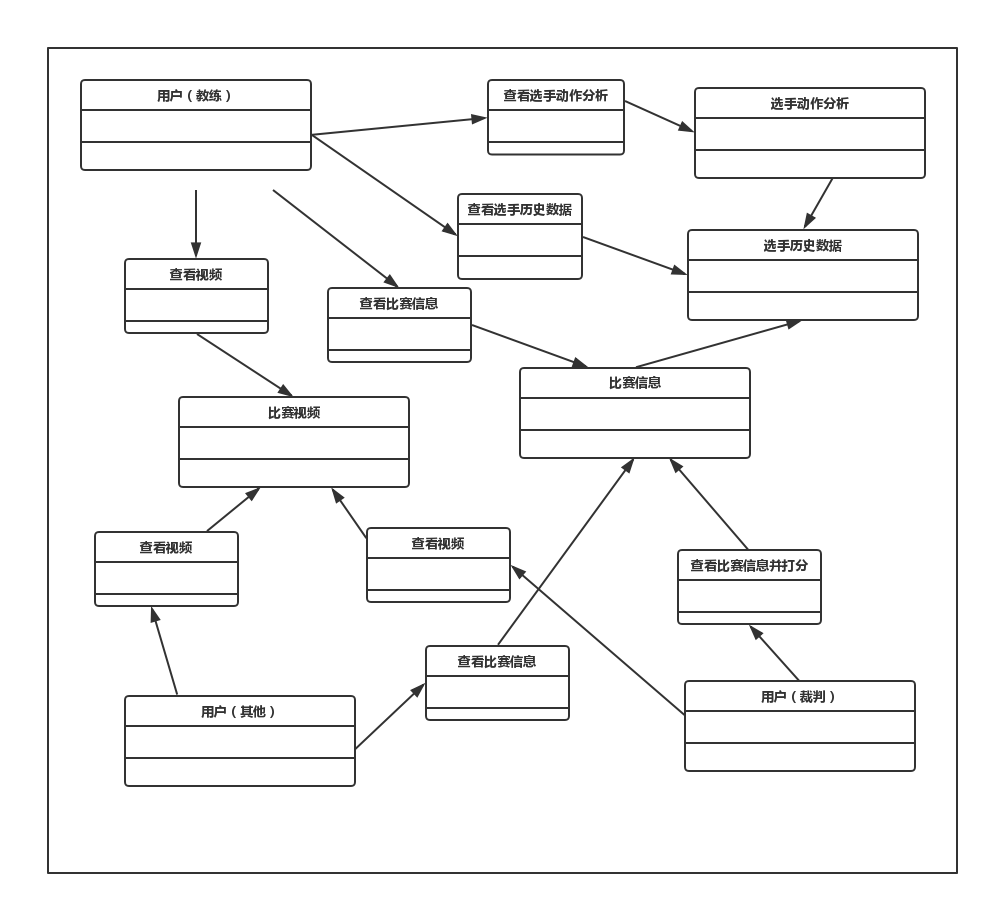

### 1.3 添加类的重要属性
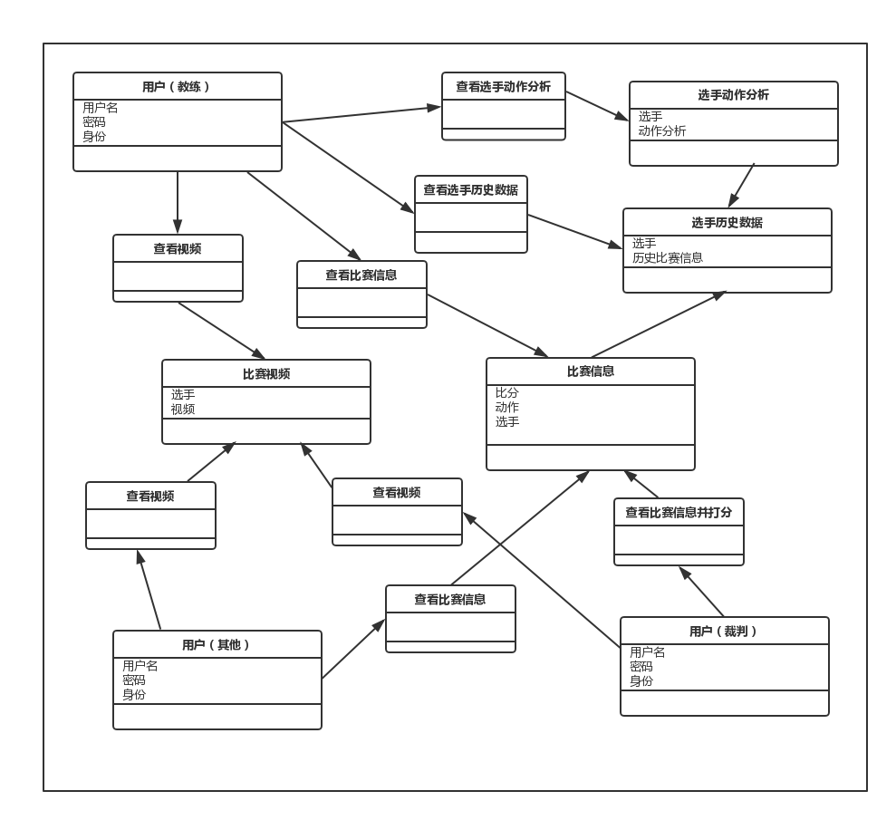

## 2. 建立行为模型

### 2.1 建立交互图(系统顺序图)

#### 2.1.1 裁判/教练/专业观众查看选手详细动作信息
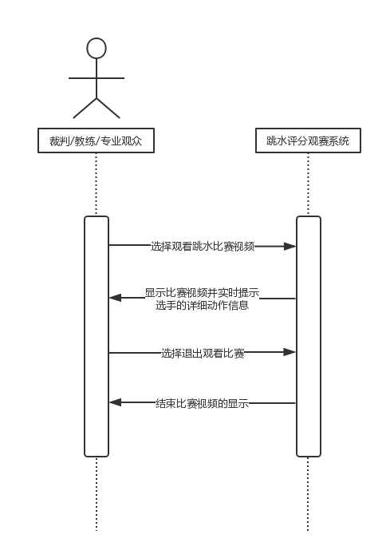

#### 2.1.2 裁判打分
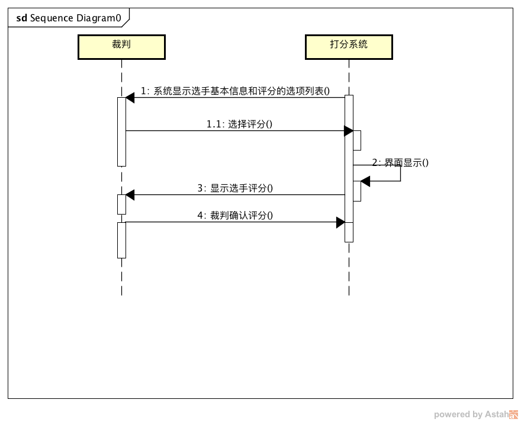

#### 2.1.3 教练查看选手历史数据及动作分析
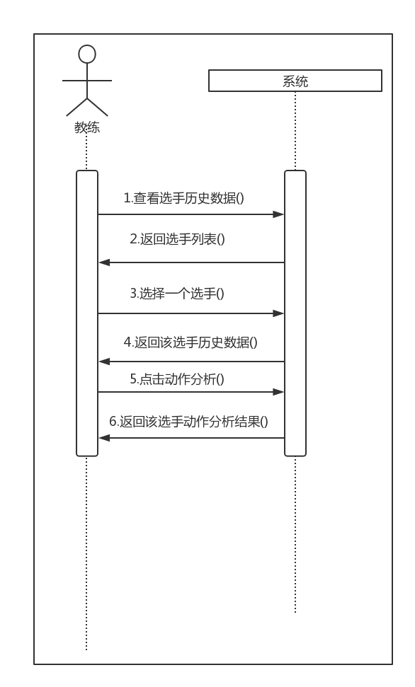

#### 2.1.4 观众观看视频
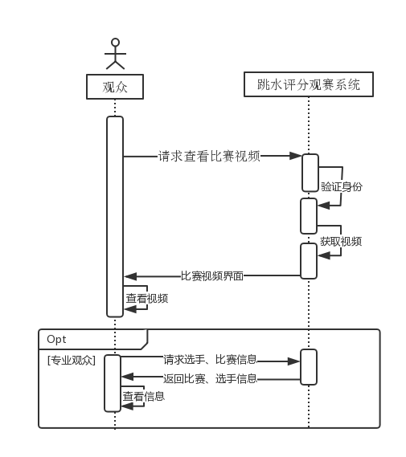
#### 2.1.5 教练观看视频
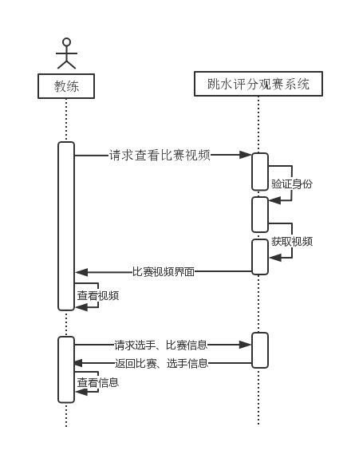

#### 2.1.6 裁判观看视频
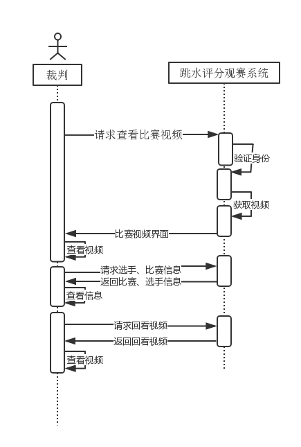

### 2.2 建立状态图

#### 2.2.1 裁判/教练/专业观众查看选手详细动作信息
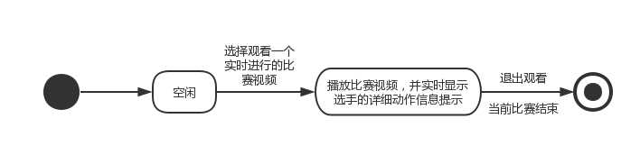

#### 2.2.2 裁判打分
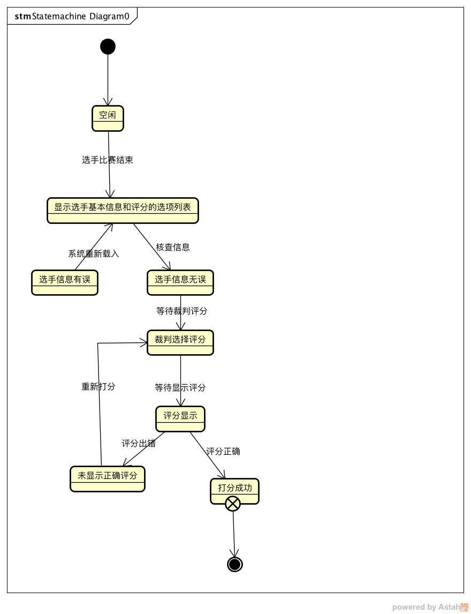

#### 2.2.3 教练查看选手历史数据及动作分析
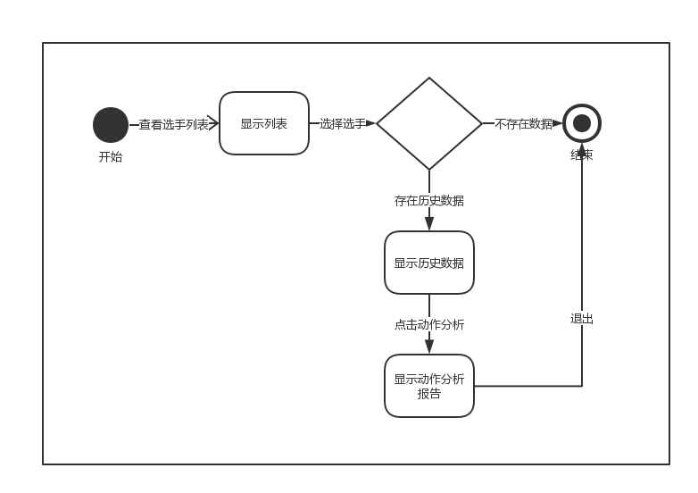

#### 2.2.4 观众观看视频

#### 2.2.5 教练观看视频
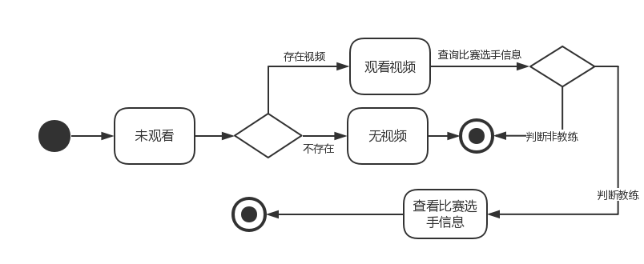
#### 2.2.6 裁判观看视频
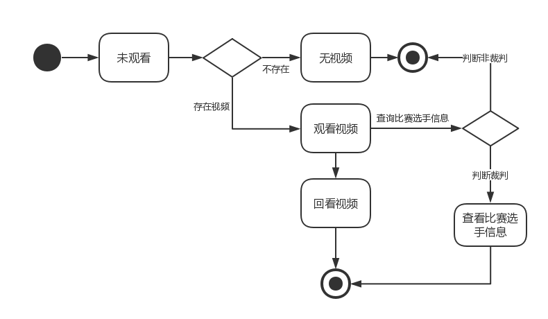

### 2.3 建立活动图

#### 2.3.1 裁判/教练/专业观众查看选手详细动作信息
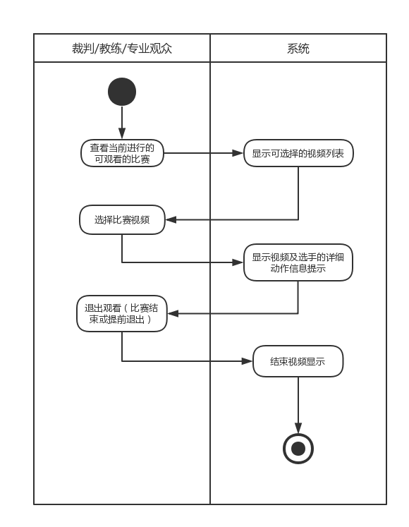

#### 2.3.2 裁判打分
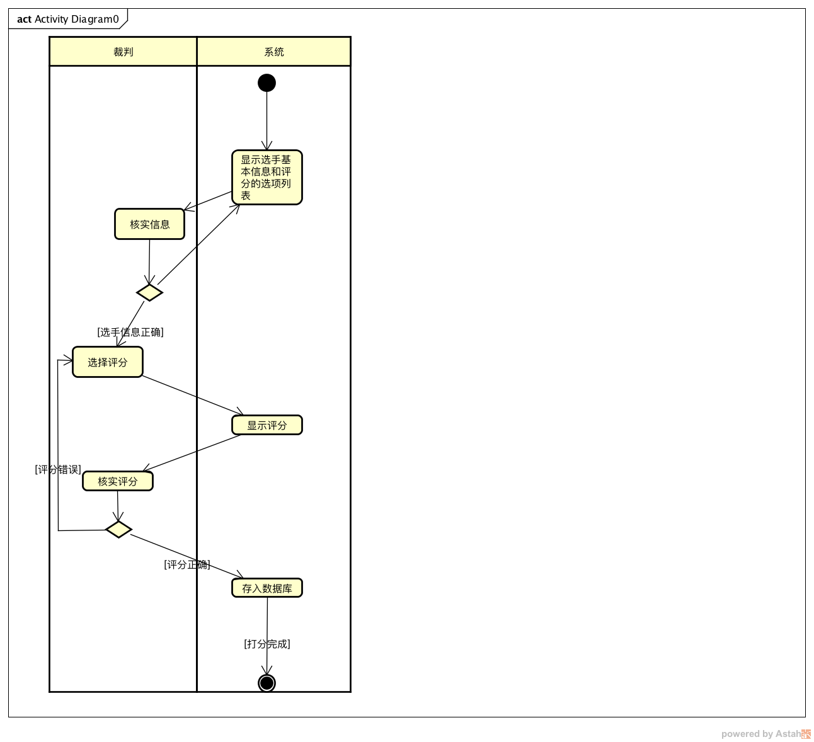

#### 2.3.3 教练查看选手历史数据及动作分析
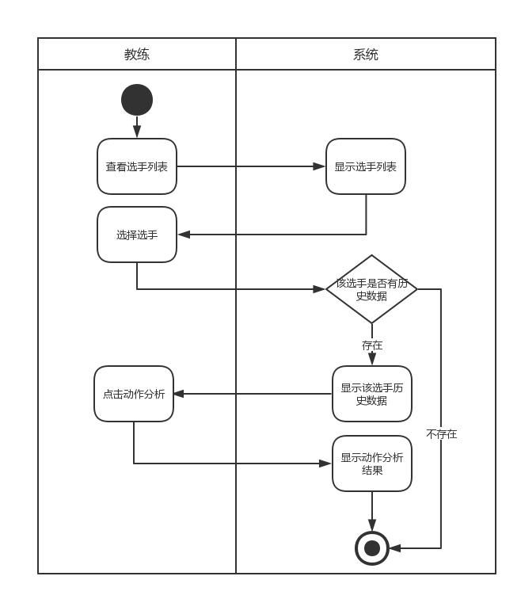

#### 2.3.4 观众观看视频
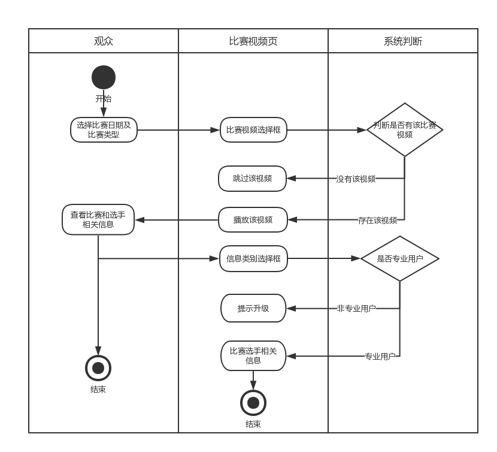
#### 2.3.5 教练观看视频
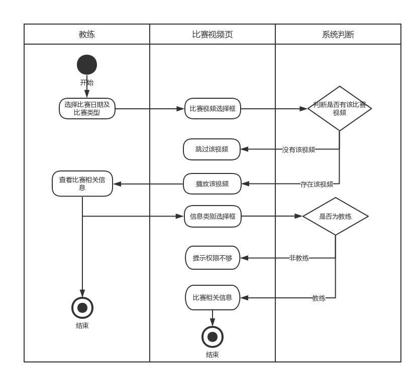
#### 2.3.6 裁判观看视频
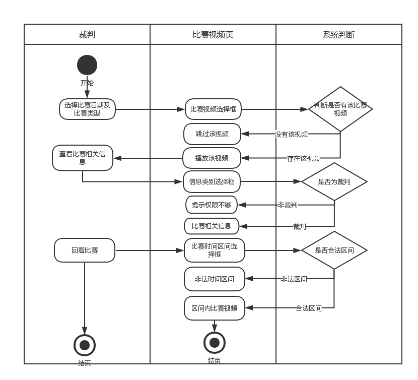

## 3. 契约说明

### 3.1 契约说明1

操作：查看选手的详细动作信息 引用：用例C1.查看选手的详细（实时）动作信息 不变量：用户只能在观看比赛时，实时看到视频旁的动作信息提示，不可作暂停/修改/删除等操作 前置条件：底层拍摄硬件正常记录并通过软件接口将信息录入系统 后置条件：无

### 3.2 契约说明2
操作：裁判打分

引用：用例C2

不变量：裁判只可以核实选手信息，不可做删除修改等其他操作

前置条件：选手比赛结束，系统显示选手基本信息和评分的选项列表

后置条件：裁判选择评分

### 3.3 契约说明 3
操作：教练查看选手历史数据及其动作分析结果 
引用：用例C3 
不变量：用户只能查看选手历史数据及其动作分析结果，不可作修改删除等 
前置条件：选手历史信息数据已存入数据库 
后置条件：教练知晓选手情况，并会设计下一次选手的动作

### 3.4 契约说明4

操作：观众观看视频

引用：用例C4

不变量：观众只能观看比赛视频，不可做删除修改等其他操作。专业用户可以查看比赛选手信息，普通用户不可以

前置条件：比赛开始，系统播放比赛视频。

后置条件：观众选择退出观看

### 3.5 契约说明5

操作：教练观看视频

引用：用例C5

不变量：教练只能观看比赛视频和查看比赛信息，不可做删除修改等其他操作。

前置条件：比赛开始，系统播放比赛视频。

后置条件：教练选择退出观看

### 3.6 契约说明6

操作：裁判观看视频

引用：用例C6

不变量：裁判只能观看比赛视频，查看比赛信息和回看视频等操作，不可做删除修改等其他操作。

前置条件：比赛开始，系统播放比赛视频。

后置条件：裁判选择退出观看

## 4 OCL
### 4.1 用例C1
	context Competition::id : String int:
	Competition::uniqueID()
	

	context Competition def:
		statics: Set(tuple(player, score, judgement) = 
			preparations -> collect(p | 
				Tuple {
					player: Player = p, 
					score: Double = average(count -> collect(judgement.score)),
					judgement = Judgement
				}
			)
			
	context Competition::getVideo():Video
	pre: self.bottomHardware.isOk() = true
	body: self.video = self.bottomHareware.transformFile()

### 4.2 用例C2
	context Judgement::grade()::double
	pre: judgement.login() = true
	body: tuple(player, self.score)  -> collect(p | 
		Tuple {
			player: Player,
			scores: average(count -> collect(scores))
		}
	)
	post: self.Competition.includes(player) and 
		self.Competition.save(player, self.score)

### 4.3 用例C3
	context Coach::getPlayerData()::List
	pre: coach.login() = true
	body: self.player -> select(self.player.name = name) -> (data: (name, age, 
		Set(tuple(competition, rank), Set(honors)) ) -> collect(p | 
			Tuple {
				age: player.age
				collect(competition, rank) -> (rank -> collect(cid, rank)) -> not empty()
				rank (player.honors) -> not empty()
			}
		)

	context Coach::analyzeProbabilisticAction::List
	pre: coach.login() = true
	body: self.player -> select(self.player.name = name) -> (predict_data
		Set(machineLearning -> analyze(self.period))
	)

### 4.4 用例C4
	context Audience::watchCompetition::bool {
		pre: self.bottomHardware.isOk() = true
		body: self.video = self.bottomHareware.transformFile()
	}
### 4.5 用例C5
	context Coach::checkCompetitionDetails::bool {
		pre: self.bottomHardware.isOk() = true
		body: self.video = self.bottomHareware.transformFile()
			 self.details -> collect(player, period).player -> select 
		  	player: player.name = self.player.name and video.period = 	self.period

	}

### 4.6 用例C6
	context Judgement::watchCompetition::bool {
		pre: self.bottomHardware.isOk() = true
		body: self.video = self.bottomHareware.transformFile()
			self.playback = video[:period] -> select (player, video, 		period) -> Tuple(player: self.player, video: self.video, period: 		self.period)
	}